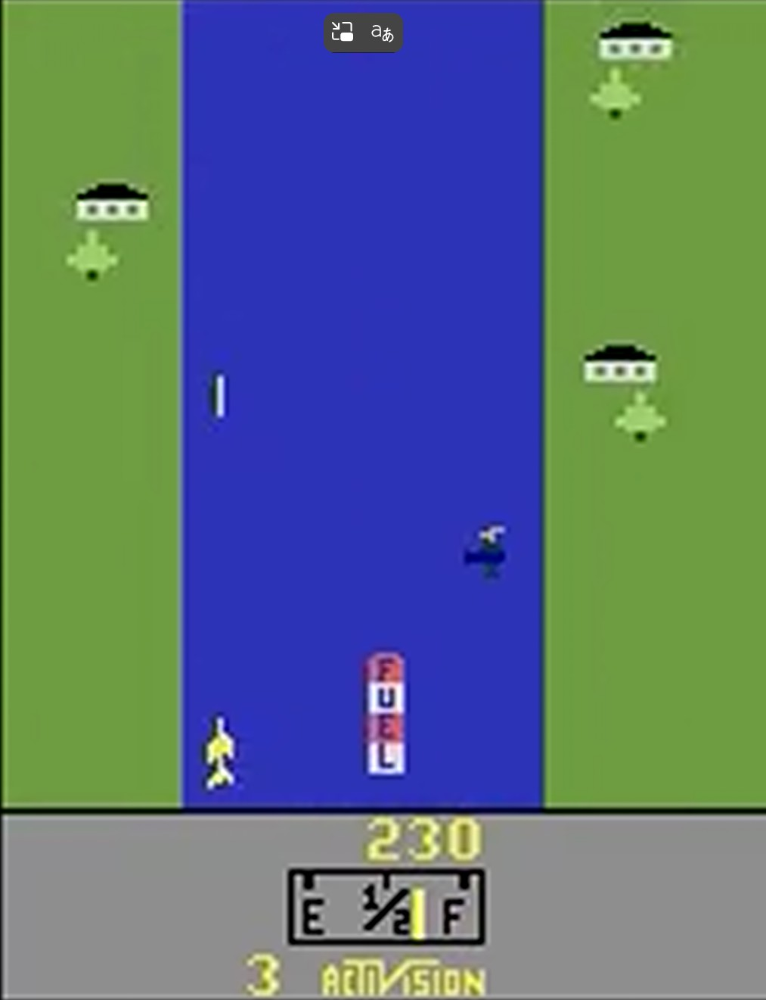

# CSCI166_Project

### River Raid

Colab Notebook Link: https://colab.research.google.com/drive/1DDtTKWgPdoD2O7MOYLwEW0UMtWwM9huC?usp=sharing

DQN Starter Code: https://github.com/everestso/summer25/blob/main/c166f25_02b_dqn_pong.ipynb

| Model Training | Thumbnail | Videos |
|:-----|:------:|------:|
| Baseline    |    | <a href="https://wosstarot.github.io/riverraidTrained-baseline_nohyp.mp4" target="_blank">▶ Watch Video</a>  |
| Double    |    |   |
| Double w/Epsilon=0.       | | |
| Double+Dueling DQN (No Hyperparameters        | | <a href="https://wosstarot.github.io/riverraidTrained_DDQN+Dueling_nohyp.mp4" target="_blank">▶ Watch Video</a>  |
| Double+Dueling DQN w/ epsilon decay       | | | 
| Double+Dueling DQN w/ replay size & replay start | | |
| Double+Dueling DQN w/ learning rate | | |
| Double+Dueling DQN w/ target_sync | |  <a href="https://wosstarot.github.io/riverraidTrained_DDQN+Dueling_AllHypTuned.mp4" target="_blank">▶ Watch Video</a> |
| Baseline           w/ all previous hyperparameters | | <a href="https://wosstarot.github.io/riverraidTrained_Baseline_AllHypTuned.mp4" target="_blank">▶ Watch Video</a> |
